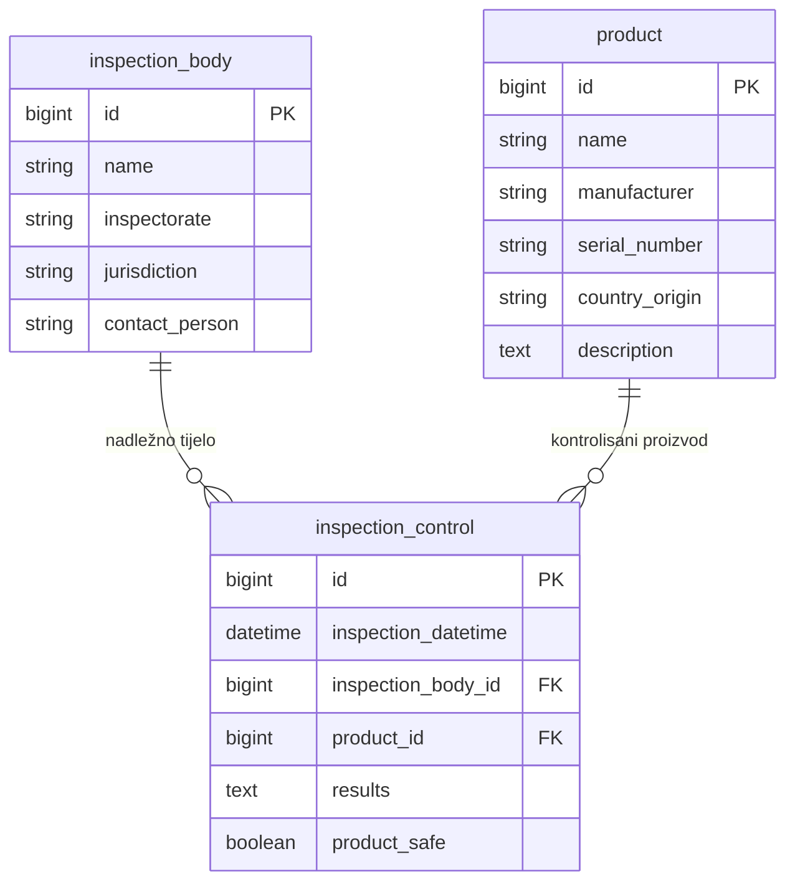

# Inspection Control System

Web aplikacija za evidenciju proizvoda, inspekcijskih tijela i izvršenih inspekcijskih kontrola proizvoda na tržištu BiH.

Aplikacija omogućava unos, izmjenu, brisanje i pregled osnovnih podataka, kao i prikaz statičkih izvještaja za izvršene kontrole.

---

## Šta je urađeno

U okviru projekta implementirane su sljedeće funkcionalnosti:

- Evidencija proizvoda
  - unos proizvoda
  - izmjena proizvoda
  - brisanje proizvoda
  - pregled svih proizvoda

- Evidencija inspekcijskih tijela
  - unos inspekcijskog tijela
  - izmjena inspekcijskog tijela
  - brisanje inspekcijskog tijela
  - pregled svih inspekcijskih tijela

- Evidencija inspekcijskih kontrola
  - unos inspekcijske kontrole
  - izmjena inspekcijske kontrole
  - brisanje inspekcijske kontrole
  - pregled svih inspekcijskih kontrola

- Validacija datuma kontrole
  - nije moguće unijeti datum inspekcijske kontrole u budućnosti

- Statički izvještaj inspekcijskih kontrola
  - odabir inspekcijskog tijela
  - odabir vremenskog perioda
  - prikaz kontrola sortiranih po datumu kontrole

- Pregled detalja inspekcijske kontrole
  - podaci o kontrolisanom proizvodu
  - datum i vrijeme kontrole
  - rezultati kontrole
  - informacija da li je proizvod siguran

- Dodatno 
  - kratke **toast** poruke (`react-hot-toast`) za greške s API-ja umjesto trajnog crvenog bannera.
  - ako proizvod ili inspekcijsko tijelo ne mogu biti obrisani jer postoje povezane kontrole, backend vraća **HTTP 409** s jasnom porukom
  - na formi inspekcijske kontrole isti **date picker** (izgled i ponašanje) kao na stranici izvještaja
  - nepoznata URL adresa u aplikaciji preusmjerava na početnu stranicu

---

## Tehnologije

### Backend

- Java 17
- Spring Boot
- Spring Web
- Spring Data JPA
- Hibernate
- MySQL
- Maven
- Lombok
- Jakarta Validation

### Frontend

- React
- TypeScript
- Vite
- React Router
- Bootstrap 5
- react-datepicker
- react-hot-toast
- Fetch API

### Baza podataka

- MySQL

---
## Dijagram baze (ER)

Pregled tabela i veza iz `inspection_control_database.sql`. Ako želite cijelu sliku kao PNG/SVG, otvorite [mermaid.live](https://mermaid.live) i zalijepite blok ispod.



---

## Struktura projekta

```text
inspection-control-system/
  api/       - Spring Boot backend aplikacija
  client/    - React frontend aplikacija
  README.md
```
